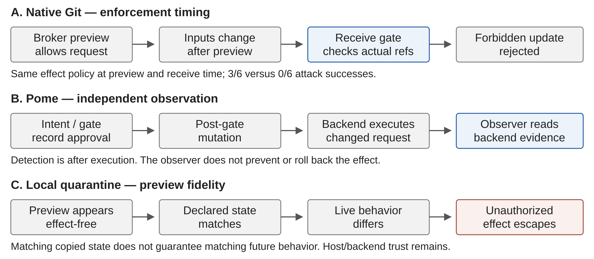

**Authoring material, not a submission manuscript.** This is the consolidated,
AI-assisted evidence package through H31. The author must review the facts and
write the final narrative in the [official template](official-template.docx).
The original `evidence-pack.pdf` and `review.html` are historical renderings;
`track1-review.pdf` and `track1-review.html` render this current source.
Nothing in this package has been submitted or independently reproduced by a reviewer.

**Author review needed:** Aditya Pratap Singh; affiliation unconfirmed. Working
report title: *Where authorization stops: auditable containment and its limits*.
The [event guidelines](https://apartresearch.com/sprints/ai-incident-response-sprint-2026-09-11-to-2026-09-13)
and template govern the final submission. Use at most 150 words for the abstract,
at most eight main pages, and include the limitations/dual-use appendix.

## Findings to review

1. **Execution-time authorization helps in the tested environments.** In native Git,
   an equally informed broker preview allowed 3/6 forbidden ref-update workflows;
   the receive-time effect gate allowed 0/6. Both completed 5/5 benign workflows.
2. **Independent backend evidence reveals effects upstream records miss.** On six
   executed Pome attacks, intent detected 0/6, gate-entry evidence 2/6 and backend
   tape 6/6. Detection did not undo those effects.
3. **Quarantine depends on preview fidelity.** Selective release blocked four
   modeled fault classes while preserving benign work, but every simulation-gap
   repetition escaped. The execution-only counterexample also persists in the
   later hosted and separate-process local studies.

These are separate experiments and denominators. They do not establish production
security, prevention of the actual incident, or quarantine superiority against a
realistic AI attacker. H27 is incomplete, H30 lacked substantive attacks, and H31
failed its search-coverage gate. Their unfavorable outcomes remain in Section 4.4.

# 1. Introduction

**Argument for the author to develop:** containment needs evidence of both the
authority checked and the effect actually executed. An accurate intent log can
miss changes later in the call path. A correct dry run can also disagree with a
later execution. The deliverable is an engineering control/evidence checklist,
backed by reproducible examples of prevention, detection and failure.

The intended reader is an agent-platform or evaluation engineer deciding where to
place enforcement and what evidence to retain. Track 1 fit rests on inspectable
requirements and practical review, not on obtaining a positive quarantine result.
No lab has assessed adoption, and no external reviewer has reproduced this package.

**Preserved research question**

> Can an adaptive effect-bound broker reduce unauthorized agent effects and detect
> execution mismatches better than intent logging or static authorization, while
> keeping legitimate actions usable?

**Preserved hypothesis**

> In a deterministic test environment, server-side capability enforcement combined
> with dynamic quarantine will prevent more tested unauthorized effects than intent
> logging or broker-only authorization, at the cost of some additional latency and
> quarantines.

The weaker-baseline hypothesis and incremental benefit over equally informed static
authorization are different claims. Evidence supports narrow parts of the former;
the latter remains conditional on modeled behavior and unestablished against
realistic attacks. [The hypothesis ledger](../hypotheses.md) retains H1–H31.

# 2. Related Work

The contribution is a control-to-evidence mapping and measured boundary failures,
not the invention of capabilities, complete mediation or simulation. Saltzer and
Schroeder [1] motivate complete mediation; Hardy [2] motivates scoped authority.
AI Control [3] motivates testing intentional subversion, but our scripted suites
are not frontier-agent evaluations. AgentDojo [4] and CaMeL [5] address related
agent-tool security questions; we neither run their benchmarks nor reproduce their
information-flow guarantees. Pome [6] supplies a separately implemented API twin;
native Git [7] supplies an execution-side ref-update interface.

# 3. Methods

## 3.1 Boundaries and authority

The early suites use a local modeled server and real local Pome GitHub twins.
Capabilities bind tool, canonical arguments, run/request identities, nonce and
expiry. A Python gate protects the Pome path; Pome itself does not validate our
capability. A separate observer fetches tape/state and retains hashed snapshots.
It is a separate process, not a separate host or independent trust root.

The native Git comparison uses identical allowed ref and old/new object predicates
at broker dry-run and receive time. The later HTTP suite runs the actor inside
Bubblewrap mount/network/PID namespaces. H29 adds separate live/preview service
processes, SQLite operation identities, explicit queued jobs and independent
snapshot subprocesses. The host, broker and backend remain trusted. Exact task
identities are prebound in H30/H31, greatly restricting their request-only search.

{width=100%}

## 3.2 What counts as evidence

A denied request or nonzero process exit alone does not establish prevention.
Native Git uses refs and journals; Pome uses received-call tape and state; H29
uses declared database state and events, including queued effects. Legitimate
completion checks outputs and duplicates in the later suites. The original local
matrix uses an acceptance proxy, which is weaker than application completion.

Missing evidence is unresolved, not clean. Receipts detect later archive alteration
only against a separately trusted anchor; originally fabricated consistent source
evidence remains a known limitation. A post-execution alert is detection, not
containment. Denied calls must not consume authority needed for legitimate work.

Synthetic fixtures and temporary repositories are used throughout. Historical Arga
runs used owned hosted twins. No real victim data or production targets were tested.
Deterministic repetitions are consistency checks, not independent random samples;
no population attack rates, significance claim or pooled success percentage is made.
Per-suite protocols, source copies and reproduction links are indexed in Appendix C.

# 4. Results

## 4.1 Execution-time authorization

**Table 1. Native Git, 44 cells.** Six adversarial and five benign workflows per
condition. Same policy information at preview and receive time.

| Git condition | Attack successes / 6 | Benign completion / 5 | False rejection / 5 |
|---|---:|---:|---:|
| Intent dispatch | 6 | 5 | 0 |
| Exact command | 6 | 3 | 2 |
| Broker preview | 3 | 5 | 0 |
| Receive gate | 0 | 5 | 0 |

The three changes after preview were blocked only at receive time. Exact command
matching is a weak baseline that rejects harmless variations. The receive gate is
itself a static effect policy; this result is **not a quarantine advantage**.
Evidence: [raw cells](../results/git-enforcement-v1/raw.json),
[summary](../results/git-enforcement-v1/summary.json), [methods](../git_enforcement.md).

**Table 2. Isolated HTTP, 51 scripted cells.** Twelve adversarial and five benign
workflows per condition, including identity changes, bypass and retry controls.

| HTTP condition | Attack successes / 12 | Benign completion / 5 | Benign extra effects |
|---|---:|---:|---:|
| Upstream approval | 11 | 4 | 1 |
| Endpoint restriction | 8 | 4 | 1 |
| Exact gateway authority | 0 | 5 | 0 |

Endpoint restriction alone did not bind the action. The weak conditions duplicated
an approved report on retry. These are ordinary-user sandbox fixtures, not kernel
escape tests. Evidence: [raw cells](../results/isolated-http-v1/raw.json),
[summary](../results/isolated-http-v1/summary.json), [methods](../isolated_http.md).

**Table 3. Earlier local matrix, 800 cases.** Seven attack and three benign scenarios
per configuration, each repeated twenty times. AS = attack successes; LC = accepted
legitimate calls; FR = false rejection; FQ = false quarantine.

| Configuration | AS / 140 | LC / 60 | FR | FQ |
|---|---:|---:|---:|---:|
| Intent only | 140 | 60 | 0 | 0 |
| Broker only | 100 | 40 | 0 | 20 |
| Static server | 0 | 40 | 20 | 0 |
| Full, hold-all | 0 | 40 | 0 | 20 |

Server enforcement improved these weaker-baseline outcomes. Static denial and
hold-all quarantine tied on prevention and acceptance. Evidence:
[raw matrix](../results/matrix_raw.json), [summary](../results/matrix_summary.json).

## 4.2 Selective-release tradeoff

**Table 4. Modeled selective release, 720 cases.** Five attack and four benign
workflows per configuration, each repeated twenty times. Completion checks values.

| Configuration | AS / 100 | LC / 80 | FR | FQ |
|---|---:|---:|---:|---:|
| Static deny-unknown | 0 | 0 | 80 | 0 |
| Hold-all | 0 | 0 | 0 | 80 |
| Selective | 20 | 80 | 0 | 0 |
| Static, same reviewed shapes | 100 | 80 | 0 | 0 |

Selective release blocked four modeled fault classes. All twenty simulation-gap
repetitions escaped, with mismatch flags only after execution. This is a conditional
benefit over equally informed permissions, not superiority over denying everything.
Evidence: [raw cells](../results/selective-release-v1/raw.json),
[summary](../results/selective-release-v1/summary.json), [methods](../selective_release.md).

**Later fidelity checks.** H26 has twelve hosted Arga cells across hold-all, static
and selective conditions. Static and selective complete both benign reads;
selective blocks the preview-visible hidden write, and both allow the execution-only
write. State equality is limited to the declared issue/access context, not full Git
identity. [H26 receipts](../results/arga-quarantine-v1/summary.json) retain all cells.

H29 has 24 normal cells plus eight fault cells. Both arms complete 12/12 normal
workflows. Selective blocks visible and deferred writes; both allow the execution-
only fault. Both also lose completion after malformed commit responses until
separate trusted reconciliation. [H29 records](../results/local-readiness-v1/summary.json)
and [the follow-up report](selfhosted-readiness.md) preserve these failures.
Copying declared state does not establish matching future behavior.

## 4.3 Independent backend evidence

**Table 5. Pome observer comparison, 16 cells.** Six executed attacks, two prevented
attempts and eight benign controls across two defense conditions.

| Evidence view | Detected / 6 | Missed / 6 | Blocked attempts alerted / 2 | False alarms / 8 |
|---|---:|---:|---:|---:|
| Intent | 0 | 6 | 0 | 0 |
| Gate | 2 | 4 | 2 | 0 |
| Backend tape | 6 | 0 | 0 | 0 |

Both post-gate reads returned synthetic file content without changing state.
Upstream records still matched approved intent; backend tape showed the mismatch.
Broker-only allowed 4/4 attacks; full gate allowed 2/4, both after the gate. Both
completed 4/4 benign tasks. Expected 404 and lost-response controls produced no
mismatch alarms. Zero alarms on eight controls is not a population estimate.
Evidence: [raw cells](../results/observer-comparison-v1/raw.json),
[summary](../results/observer-comparison-v1/summary.json), [methods](../observer_comparison.md).

\newpage

## 4.4 Model pilots, repairs and costs

**Table 6. Complete pilot status; never pool these denominators.**

| Study | Model calls | Final cells completed / planned | Interpretation |
|---|---:|---:|---|
| H27, hosted | 10 | 3 / 18 | Arga quota stopped the run; no completed matched attack pair. |
| H30, local | 10 | 18 / 18 | Four empty and two authorized-only candidates; no substantive attack coverage. |
| H31, local adaptive | 12 | 0 / 18 | Nine outputs exhausted their token limit; coverage gate failed. |

H27 found request-ID poisoning that disrupted a legitimate report. A benign mixed
quarantine workflow also failed after the write because preview state could not be
reconstructed. H28 repaired those known issues: 36 before/after replay cells and
12 separate fault controls remain archived. Fixed replay completes 9/9 per arm;
this is post-discovery regression evidence, not fresh attack resistance.

H30 completes 9/9 final tasks per arm without effects or holds, but its candidates
do not test adversarial boundaries. H31 produces two unsuccessful static probes,
one authorized serialization check and nine invalid outputs (all six selective
outputs invalid). All twelve development continuations complete, mostly with empty
attack phases. No final candidate is generated. Full inventory, costs, latency,
tokens and failed trials are in [H27](openai-pilot.md), [H28](pilot-followup.md) and
[H29–H31](selfhosted-readiness.md). Neither study resolves quarantine superiority.

Estimated model charges are H27 $0.1359192, H30 $0.0952803, H31 $1.163796; total
$1.3949955, not an account invoice. H30 median final-cell latency is 0.554 seconds
static versus 1.325 selective. H31 development medians are 0.662 versus 2.789 seconds,
but different request sequences make that an unmatched comparison. No model calls
or performance experiments were added during this report consolidation.

# 5. Discussion and Limitations

**Defensible implication:** evaluate authority at the effect-producing boundary,
retain evidence independent of actor claims, and reject the inference that a clean
preview guarantees clean execution. Appendix B translates these findings into
acceptance rules and known failures. It is a proposed engineering checklist, not an
adopted standard or deployment certificate.

The prototype does not test compromise of the permitted egress service, host or
kernel, arbitrary malicious tool code, production workflows or general covert
channels. It cannot be claimed to have stopped the actual incident. The static
Git result and selective-preview result measure different mechanisms. Neither
should be relabeled to manufacture support for the other.

An outside reviewer can run the [offline procedure](README.md#offline-reviewer-procedure)
without lab credentials. That verifies the supplied package under its source/host
assumptions, not a lab's actual network or original evidence authenticity. A lab
would still need route/credential inventory, retained evidence anchors, versioned
policy and an owner for uncertain commits. Independent replication and adoption
assessment remain pending. Further model work is deferred until usable outputs
and a discriminating attack interface are demonstrated on separate development data.

# 6. Conclusion planning

Write the final conclusion using the three checked findings above. State that the
added-prevention hypothesis remains qualified: strong local execution enforcement,
stronger downstream mismatch evidence, and a conditional preview benefit with a
reproducible escape. Do not claim perfect containment, formal verification,
production readiness, novel invention of capabilities or realistic AI resistance.

# Code and Data

The [repository README](../README.md) supplies pinned dependencies and reproduction
commands. Appendix C indexes the saved experiments; no evidence was regenerated or
removed for this report. An accessible artifact location still needs author review.
Local paths are not public links. Nothing has been committed, pushed or published
as part of this consolidation.

# Author Contributions and LLM Usage

Aditya directed the research, challenged claims and approved experiments. AI coding
assistance contributed implementation, tests, execution and these authoring notes.
Automated verification is **not independent human verification**. The author must
review the facts, confirm affiliation and write/revise the final report and actual
LLM-use disclosure. Do not claim external review or original human authorship of
these preparation notes.

\newpage

# References

1. Saltzer, J. H., and Schroeder, M. D. (1975). *The Protection of Information in
   Computer Systems*. [Paper](https://web.mit.edu/Saltzer/www/publications/protection/).
2. Hardy, N. (1988). *The Confused Deputy*. ACM SIGOPS Operating Systems Review.
   [DOI](https://doi.org/10.1145/54289.871709).
3. Greenblatt, R., et al. (2023). *AI Control: Improving Safety Despite Intentional
   Subversion*. [arXiv:2312.06942](https://arxiv.org/abs/2312.06942).
4. Debenedetti, E., et al. (2024). *AgentDojo: A Dynamic Environment to Evaluate
   Prompt Injection Attacks and Defenses of LLM Agents*.
   [arXiv:2406.13352](https://arxiv.org/abs/2406.13352).
5. Debenedetti, E., et al. (2025). *Defeating Prompt Injections by Design*.
   [arXiv:2503.18813](https://arxiv.org/abs/2503.18813).
6. Pome contributors. *Digital Twins*. [Repository](https://github.com/pome-sh/digital-twins).
   Experiments pin CLI 0.43.0 and Node 24.21.0 rather than current upstream.
7. Git project. *Git 2.43.0 hooks, pre-receive*.
   [Documentation](https://git-scm.com/docs/githooks/2.43.0#_pre_receive).

# Appendix A. Limitations and Dual-Use Considerations

**Trust and fidelity:** signed requests do not constrain a compromised backend.
Early nonce storage is process-local; later gateway operation identities are durable,
not a distributed revocation system. One host still controls observer, broker and
service. A consistent fabricated source can pass receipt validation. The declared
queue/state model does not cover arbitrary delayed effects. The original local
suite also retains an authorized secret read followed by unlabelled output leakage.
No production secret or live victim data was used.

**Method:** constructed attacks, small scenario diversity, shared implementation
assumptions and deterministic repetitions limit inference. Pome tape/state reads
are separate quiescent requests, not an atomic global snapshot. Arga cloning is not
full service-state fidelity. H27's unfinished comparison, H30's missing adversarial
coverage and H31's reasoning-token exhaustion are retained, not replaced by later
successes. Later fixes do not retroactively change earlier evidence.

**Dual use:** mutation fixtures illustrate authorization and monitoring weaknesses.
All tests stay in owned synthetic environments. Do not repurpose them against third
parties. Real deployment logs may contain sensitive content; access controls and
redaction must preserve enough information for effect verification. Disclosure and
license decisions belong to the author before publication.

\newpage

# Appendix B. Proposed evidence-bound containment checklist

Draft requirements for engineering review, **not an adopted or certified standard**.
A third party can reproduce the benchmark checks without a lab network, but cannot
infer a real lab's isolation, policy quality or compliance from those checks alone.

This mapping includes the later isolated/local studies without rewriting their
frozen protocols. Proposed **core** controls apply to the declared tool boundary;
**Q1** additionally applies whenever preview is offered as a containment guarantee.
For each declared control, use PASS only when its checks and provenance evidence
are present; FAIL for a demonstrated violation; NOT VERIFIED for missing evidence.
A passing test runner can correctly demonstrate a FAIL control through a negative
fixture. No overall deployment-compliance certificate is issued by this repository.

The [reviewer procedure](README.md#offline-reviewer-procedure) checks retained
artifacts and reruns local boundary fixtures without accounts. It is not independent
human replication: that remains outstanding. A lab adopting these requirements
would need to supply its route/credential inventory, versioned policy and software,
independently retained evidence anchors and documented owner for uncertain commits.
Local package verification cannot authenticate that deployment inventory by itself.

For practical adoption, first use the harness with synthetic staging tasks and the
deployment's actual approved policy; measure legitimate failures and operating
overhead before rollout. Restrict any preview claim to demonstrated fidelity and
require an execution-side control for effects that preview cannot constrain.
No lab has evaluated this adoption procedure yet. The actual incident's permitted
egress-service compromise is not reproduced here, so we cannot say this prototype
would have stopped it.

## Acceptance tests, measured outcomes and residual limits

Each row links a runnable acceptance test to a measured result. The referenced
negative controls are expected to demonstrate failure; green pytest output is not
an overall compliance verdict. The controls apply only within their declared scope.

| Control | Acceptance test | Measured result | Residual limit |
|---|---|---|---|
| **C1. Dispatch only exact authority.** | [Wire and authority tests](../tests/test_http_boundary.py) | HTTP exact gate: 0/12 attack successes, 5/5 benign completion (Table 2). | No endpoint/host compromise claim. |
| **C2. Deny alternate actor routes.** | [OS/backend boundary test](../tests/test_http_boundary.py) | Endpoint-only restriction still permits 8/12; exact gateway permits 0/12 (Table 2). | Deployed route/credential inventory NOT VERIFIED. |
| **C3. Keep one effect per operation across retries.** | [Process/restart tests](../tests/test_runtime_recovery.py), [reconciliation](../tests/test_local_sandbox.py) | H29 ordinary workflows: 12/12 per arm; malformed commit response loses completion in both. | Trusted reconciliation required; multi-host recovery untested. |
| **C4. Retain independently acquired call/effect evidence.** | [Tamper/source tests](../tests/test_evidence.py), [observer controls](../tests/test_observers.py) | Backend tape detects 6/6 executed attacks; gate detects 2/6 (Table 5). | Original source forgery and compromised host remain. |
| **C5. Hold missing previews; retain uncertain commits.** | [Observer timeout](../tests/test_runtime_recovery.py), [unsupported operations](../tests/test_broker_workflow.py) | Unsupported/timed-out preview holds; H29 uncertain response preserved without automatic redispatch. | Availability loss is explicit; operational escalation untested. |
| **C6. Check useful outputs and preserve every trial.** | [Value/duplicate oracle](../tests/test_local_sandbox.py), [search gate](../tests/test_adaptive_pilot.py) | H30 9/9 completion per arm without meaningful attacks; H31 0/18 final cells. | No general agent-workload or realistic-resistance estimate. |
| **Q1. Validate preview state and behavior before claiming safety.** | [Fault visibility tests](../tests/test_local_sandbox.py) | Visible/deferred writes blocked by selective; execution-only write escapes both (H29). | General fidelity claim FAILS. |

# Appendix C. Evidence index and author handoff

## Experiment index

Do not combine counts across these suites. Source archives describe the implementation
that actually ran; the current working implementation includes later repairs.

| Evidence | Inventory and scope | Full methods/results |
|---|---|---|
| Original local/Pome suites | 800 matrix cases; 720 selective cases; 20 earlier Pome cells; 16 observer cells; 11 workflow checkpoints. | [Hypothesis ledger](../hypotheses.md), [observer methods](../observer_comparison.md) |
| Native Git | 16 evidence cells, then 44 enforcement cells; received ref effects, not quarantine. | [Evidence](../git_evidence.md), [enforcement](../git_enforcement.md) |
| Boundary/HTTP | 21 boundary-audit records; 51 isolated HTTP cells. | [HTTP study](../isolated_http.md), [audit source](../run_boundary_audit.py) |
| Integrated broker/Arga | Two local integrated workflows; three hosted guard conditions; twelve separate-twin quarantine cells. | [Arga comparison](../arga_comparison.md) |
| H27/H28 | Hosted pilot 3/18 final cells; repairs 36 replay cells plus 12 fault controls. | [H27](openai-pilot.md), [H28](pilot-followup.md) |
| H29/H30/H31 | 32 readiness cells; 18 completed H30 final cells; 12 H31 development cells, zero final cells. | [Complete follow-up](selfhosted-readiness.md) |

The [reviewer procedure](README.md#offline-reviewer-procedure) verifies historical
records and checks later studies on temporary copies. It includes local synthetic
acceptance tests. This consolidation adds no model calls, cloud provisioning or
new performance trial. The implementation-review diagnostics retain historical
failures separately in [the review](implementation-review.md); they are not claims
that repaired defects still exist.

## Decisions for the author

- Confirm the three findings, their denominators and the distinction between
  execution-time static enforcement and preview-dependent quarantine.
- Confirm author name and affiliation. Do not imply employer endorsement.
- Write the final abstract in at most 150 words: problem, tested boundary, three
  findings and the fidelity limitation. This pack deliberately provides evidence
  and a structure rather than asserting a human-written final abstract.
- Transfer the reviewed argument into the official template. Follow its section
  order; keep Figure 1 and numbered tables, with scope in every caption.
- State actual AI assistance and review performed. Independent reproduction and
  adoption assessment are pending, not completed author contributions.
- Choose an accessible evidence location and license; review sensitive material
  before sharing. A local review URL is not a published artifact.
- Check the final PDF's eight-page main-text limit separately from this review
  copy. Include references and the required limitations/dual-use appendix.
- Authorize submission explicitly when ready; nothing is submitted by these checks.

## Final-template transfer map

| Template section | Material to use | Author action |
|---|---|---|
| Title / author / abstract | Findings summary; confirmed identity | Write abstract last; confirm affiliation. |
| Introduction / related work | Sections 1–2 | Explain practical contribution without novelty inflation. |
| Methods / results | Sections 3–4 and Figure 1 | Preserve trust boundaries, denominators and failed pilots. |
| Discussion / conclusion | Sections 5–6 | State conditional claims and unresolved fidelity. |
| Code/data / contributions / LLM use | Corresponding sections | Supply approved artifact location and truthful disclosure. |
| References / appendices | References and Appendices A–C | Check citations, required limitations and final pagination. |
